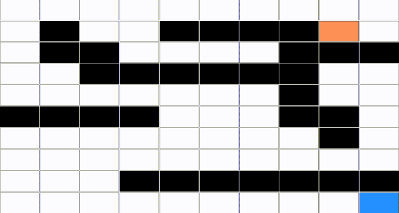

# Projeto : Fase 1
## Inteligência Artificial 22/23
Prof. Joaquim Filipe

Eng. Filipe Mariano

# Dots and Boxes
**Dots and Boxes** é um [jogo de lápis e papel](https://en.wikipedia.org/wiki/Pencil_and_paper_game "jogo de lápis e papel") para dois jogadores. 
Este tem como objetivo fechar o maior numero de caixas possíveis. Aplicando apenas riscos ligando os pontos apresentados no tabuleiro.

## Manual Técnico
Realizador por: 

Dinis Pimpão -> 201901055

Pedro Peralta -> 202002153

## Índice
 1. Introdução
 2. Arquitetura do Sistema
 3. Entidades
 4. Algoritmos e Implementações
 5. Resultados Finais
 6. Limitações Técnicas

## 1 - Introdução
No âmbito da unidade curricular de **Inteligência Artificial**, os professores propuseram o desenvolvimento de algoritmos de procura de estados para resolver problemas no jogo **Dots and Boxes**.

O objetivo deste projeto é resolver os problemas lidos no ficheiro disponibilizado com diferentes tabuleiros. Fechando o numero de caixas requisitado no menor numero de jogadas possíveis.

O projeto foi implementado na linguagem de programação funcional Common Lisp, .... (meter aqui o porque de ter sido escolhido o lisp)

## 2- Arquitetura do Sistema
O projeto é composto por 3 ficheiros:

 - **projeto.lisp** ->  Carrega os outros ficheiros de código, escreve e lê ficheiros, e trata da interação com o utilizador. 
 - **puzzle.lisp** -> Código relacionado com o problema. 
 - **procura.lisp** -> Contem a implementação de:
	 - 1. Algoritmo de Procura de Largura Primeiro (BFS)
	 - 2. Algoritmo de Procura do Profundidade Primeiro (DFS) 
	 - 3. Algoritmo de Procura do Melhor Primeiro (A*) 
	 - 4. Os algoritmos SMA*, IDA* e/ou RBFS (caso optem por implementar o bónus)

## 3- Entidades 

### Tabuleiro
O tabuleiro consiste na representação de uma lista com duas listas:

 - **Lista de Linhas Horizontais** 
 - **Lista de Linhas Verticais** 

O tamanho do tabuleiro depende do que é lido no ficheiro problemas.dat.

Exemplo de um tabuleiro inicial:

    (
    	((0 0 0) (0 0 1) (0 1 1) (0 0 1)) 
    	((0 0 0) (0 1 0) (0 0 1) (0 1 1))
    )

Representacao grafica do nivel escolhido:
```
+  +  +  +
            
+  +  +--+
   |     |  
+  +--+--+
      |  |  
+  +  +--+
```

### Operadores
Existem dois tipos de operadores, um operador para aplicar uma linha na horizontal e outra na vertical.
É passado por parâmetro a localização da linha a ser aplicada e o estado do tabuleiro.

Exemplo de utilização:
 - `(arco-horizontal 0 1 '(((0 0 0) (0 0 1) (0 1 1) (0 0 1)) ((0 0 0) (0 1 0) (0 0 1) (0 1 1)))`
 - `(arco-vertical 0 2 '(((0 0 0) (0 0 1) (0 1 1) (0 0 1)) ((0 0 0) (0 1 0) (0 0 1) (0 1 1)))`


### Composição do Nó

Cada nó é composto pelo estado do tabuleiro, a profundidade, a heurística e o nó pai.

Exemplo do nó inicial do problema A:
`((((0 0 0) (0 0 1) (0 1 1) (0 0 1)) ((0 0 0) (0 1 0) (0 0 1) (0 1 1))) 0 2 NIL)`

#### Seletores do Nó
 - *no-estado*
 - *no-profundidade*
 - *no-heurística*
 - *no-pai*
 - *cria-no*
 - *get-arcos-horizontais*
 - *get-arcos-verticais*
 - *get-arco-na-posicao*

## Algoritmos e Implementações
O principal objetivo deste projeto consiste em fechar o numero de caixas requisitado com o menor numero de jogadas possíveis. Para tal, utilizamos os algoritmos lecionados na unidade curricular para solucionar os problemas apresentados.

### Solução
| Problema | Objetivo |
|--|--|
| A | 3 |
| B | 7 |
| C | 10 |
| D | 10 |
| E | 20 |
| F | 35 |

Função utilizada para saber se um nó é solução do problema (para os algoritmos BFS e DFS)
```lisp
(defun no-solucaop (no objetivo)
  (cond ((= (closed-boxes (no-estado no)) objetivo) T)
        (T nil)
  )
)
```

Função utilizada para saber se um nó é solução do problema (para o algoritmo A*, com recurso à heurística)
```lisp
(defun no-solucaop-astar (no)
  (cond ((= (no-heuristica no) 0) T)
        (T nil)
  )
)
```

## BFS (Breadth First Search)
O algoritmo tem como função a pesquisa numa árvore procurando por toda a largura da árvore. Começando do nó da raiz até ao nó solução, explorando todos os nós vizinhos antes de passar à próxima profundidade da árvore.


```lisp
(defun bfs (no-inicial fn-solucao fn-sucessores operadores caixas-a-fechar &optional (abertos nil) (fechados nil))
  (cond ((and (null abertos) (null fechados)) (bfs no-inicial fn-solucao fn-sucessores operadores caixas-a-fechar (list no-inicial) fechados))
        ((null abertos) nil)
        (T
          (let* (
            ;;coloca o 1 de abertos em fechados
            (novos-fechados (append fechados (list (car abertos))))
            ;;gera sucessores, verifica se ja estao em fechados e caso estejam, nao os coloca na lista de sucessores unicos
            (sucessores-unicos (nos-unicos-bfs novos-fechados (funcall fn-sucessores (car abertos) operadores 'bfs)))
            ;;testa todos os nos sucessores para ver se algum é solução e coloca numa lista
            (no-objective-value (no-objetivo sucessores-unicos fn-solucao caixas-a-fechar)) 
            )
            ;;caso a lista anterior tenha algum elemento, devolve uma lista com o primeiro elemento que é solucao
						;;o numero de nos gerados e o numero de nos expandidos
            (cond ((not (null no-objective-value)) (list (car no-objective-value) (list (- (+ (length (cdr abertos)) (length novos-fechados) (length sucessores-unicos)) 1) (length novos-fechados))))
                  (t (bfs no-inicial fn-solucao fn-sucessores operadores caixas-a-fechar (abertos-bfs (cdr abertos) sucessores-unicos) novos-fechados))
            )
          )
        )
  )
)
```

## DFS (Depth-first search)
O algoritmo tem como função a pesquisa numa árvore procurando primeiro na profundidade da árvore. Começa no nó da raiz e vai ate ao nó folha. No nosso algoritmo é introduzido um limite de profundidade no algoritmo.


```lisp
(defun dfs (no-inicial fn-solucao fn-sucessores operadores depth caixas-a-fechar &optional (abertos nil) (fechados nil))
  (cond ((and (null abertos) (null fechados)) (dfs no-inicial fn-solucao fn-sucessores operadores depth caixas-a-fechar (list no-inicial) fechados))
        ((null abertos) nil)
        (T 
          (let* (
            ;;coloca o 1 de abertos em fechados
            (novos-fechados (append fechados (list (car abertos))))
            ;;gera sucessores, verifica se ja estao em fechados ou abertos e caso estejam verifica tambem se a depth é menor.
            ;;se a depth for menor coloca na lista de sucessores tambem
            (sucessores-unicos (nos-unicos-dfs abertos novos-fechados (funcall fn-sucessores (car abertos) operadores 'dfs depth)))
            ;;testa todos os nos sucessores para ver se algum é solução e coloca numa lista
            (no-objective-value (no-objetivo sucessores-unicos fn-solucao caixas-a-fechar))
            )
            ;;caso a lista anterior tenha algum elemento, devolve uma lista com o primeiro elemento que é solucao
						;;o numero de nos gerados e o numero de nos expandidos
            (cond ((not (null no-objective-value)) (list (car no-objective-value) (list (- (+ (length (cdr abertos)) (length novos-fechados) (length sucessores-unicos)) 1) (length novos-fechados))))
                  (t (dfs no-inicial fn-solucao fn-sucessores operadores depth caixas-a-fechar (abertos-dfs (cdr abertos) sucessores-unicos) (remove-sucessores-from-fechados novos-fechados sucessores-unicos)))
            )
          )
        )
  )
)
```


## A* (A* Search Algorithm)
O algoritmo tem como função a pesquisa numa árvore tendo em conta o seu valor heurístico.



```lisp
(defun astar (no-inicial fn-solucao fn-sucessores operadores caixas-a-fechar heuristica-a-usar &optional (abertos nil) (fechados nil))
  (cond ((and (null abertos) (null fechados)) (astar no-inicial fn-solucao fn-sucessores operadores caixas-a-fechar heuristica-a-usar (list no-inicial) fechados))
        ((null abertos) nil)
        ;;testar se é no soluçao logo aqui, antes de expandir ao contrario dos outros algoritmos
        ;;caso o no seja solucao, devolve uma lista com o primeiro elemento que é solucao, o numero de nos gerados e o numero de nos expandidos
        ((funcall fn-solucao (car abertos)) (list (car abertos) (list (- (+ (length (cdr abertos)) (length fechados)) 1) (length fechados))))
        (T 
          (let* (
            ;;coloca o 1 de abertos em fechados
            (novos-fechados (append fechados (list (car abertos))))
            ;;gera sucessores, verifica se ja estao em fechados ou abertos e caso estejam verifica tambem se o custo (f=g+h) é menor.
            ;;se o custo for menor coloca na lista de sucessores tambem ---- (o 0 aqui é so um placeholder para o depth)
            (sucessores-unicos (nos-unicos-astar abertos novos-fechados (funcall fn-sucessores (car abertos) operadores 'astar caixas-a-fechar heuristica-a-usar)))
            )
            (astar no-inicial fn-solucao fn-sucessores operadores caixas-a-fechar heuristica-a-usar (colocar-sucessores-em-abertos (cdr abertos) sucessores-unicos) (remove-sucessores-from-fechados novos-fechados sucessores-unicos))
          )
        )
  )
)
```

### Ordena Nós
Função para ordenar os nós consoante o valor da função custo.

**Função**:
```lisp
(defun ordenar-nos (lista)
  (sort lista #'< :key #'calcular-custo-no-astar)
)
```

Função auxiliar para ordenação
```lisp
(defun calcular-custo-no-astar (no)
  (+ (no-profundidade no) (no-heuristica no))
)
```

### Heurística
O valor heurístico permite-nos avaliar a qualidade da nossa jogada e o quão perto nos deixa do objetivo esperado.

#### Heurística Base
No enunciado, foi apresentada uma heurística base que consiste em calcular a diferença entre o **numero de caixas** que queremos fechar com o **numero de caixas fechadas**.

```lisp
(defun calcular-heuristica-dada (no-estado objetivo)
  (- objetivo (closed-boxes no-estado))
)
```


### Heurística Própria V1
Esta foi a nossa primeira heurística desenvolvida. Mais à frente pode-se observar que mesmo assim ainda não conseguia resolver todos os problemas.

`(objetivo_caixas - caixas_fechadas) * (|numero_arcos_horizontais_colocados + numero_arcos_verticais_nao_colocados| + 1)`

```lisp
(defun calcular-heuristica-propria (no-estado objetivo)
  (* (- objetivo (closed-boxes no-estado)) (+ 1 (abs (- (get-arcos-nao-colocados (get-arcos-horizontais no-estado)) (get-arcos-nao-colocados (get-arcos-verticais no-estado))))))
)
```

### Heurística Própria V2
Esta foi a nossa segunda heurística desenvolvida. Com esta passou a ser possível resolver todos os problemas apresentados. É possível observar um comportamento semelhante ao uso do algoritmo DFS, uma vez que ao utilizar a seguinte expressão, está-se a priviligiar uma solução com menor número de arcos em falta.

`(objetivo_caixas - caixas_fechadas) * (numero_arcos_horizontais_nao_colocados + numero_arcos_verticais_nao_colocados)`

```lisp
(defun calcular-heuristica-propria-v2 (no-estado objetivo)
  (* (- objetivo (closed-boxes no-estado)) (+ (get-arcos-nao-colocados (get-arcos-horizontais no-estado)) (get-arcos-nao-colocados (get-arcos-verticais no-estado))))
)
```

## Resultados Finais

### BFS
Os resultados apresentados têm apenas os dois primeiros problemas. Os restantes apresentaram erro de stack overflow devido ao elevado numero de funções recursivas.
| Problema | Tempo | Nós Gerados | Nós Expandidos | Profundidade | Penetrância | Ramificação Média
|--|--|--|--|--|--|--|
| A | 0.0s | 46 | 3 | 2 | 0.04347826 | 6.3010926
| B | 0.0s | 15 | 1 | 1 | 0.06666667 | 14.999912
| C | N/A | Stack overflow | Heap limit
| D | N/A | Stack overflow | Heap limit
| E | N/A | Stack overflow | Heap limit
| F | N/A | Stack overflow | Heap limit

### DFS
Os resultados apresentados permitem ver que o algoritmo DFS consegue obter resultados para todos os problemas.
| Problema | Tempo | Nós Gerados | Nós Expandidos | Profundidade | Profundidade Max | Penetrância | Ramificação Média
|--|--|--|--|--|--|--|--|
| A | 0.0s | 45 | 3 | 3 | 10 | 0.06666667 | 3.1675992
| B | 0.0s | 15 | 15 | 1 | 10 | 0.06666667 | 14.999912
| C | 0.031s | 156 | 13 | 13 | 20 | 0.083333336 | 1.3264055
| D | 1.172s | 1170 | 39 | 39 | 50 | 0.033333335 | 1.1354472 
| E | 0.61s | 770 | 28 | 28 | 50 | 0.036363636 | 1.1869614
| F | 22.234s | 5890 | 95 | 95 | 100 | 0.016129032 | 1.0635048

### A* (Heurística Dada)
Os resultados apresentados têm apenas os três primeiros problemas. Não foi possível obter resultados dos problemas D a F uma vez que acabariam por dar erro de Heap Limit no Lispworks ou Stackoverflow ao elevado número de funções recursivas.

| Problema | Tempo | Nós Gerados | Nós Expandidos | Profundidade  | Penetrância | Ramificação Média
|--|--|--|--|--|--|--|
| A | 0.0s | 30 | 2 | 2 | 0.06666667 | 4.9999113
| B | 0.0s | 14 | 1 | 1 | 0.071428575 | 13.999823
| C | 2.0s | 7924 | 1403 | 8 | 0.0010095912 | 2.9144683
| D | N/A | Stack overflow | Heap limit
| E | N/A | Stack overflow | Heap limit
| F | N/A | Stack overflow | Heap limit

### A* (Heurística Propria V1)
Com esta primeira versão da Heurística Propria passou a ser possível resolver o problema E e o a resolução do problema C passou a demorar menos tempo e a gerar menos nós. Tal como anteriormente, não foi possível resolver os problemas D e F.


| Problema | Tempo | Nós Gerados | Nós Expandidos | Profundidade  | Penetrância | Ramificação Média
|--|--|--|--|--|--|--|
| A | 0.0s | 30 | 2 | 2 | 0.06666667 | 4.9999113
| B | 0.0s | 14 | 1 | 1 | 0.071428575 | 13.999823
| C | 0.0s | 401 | 38 | 8 | 0.019950126 | 1.9321432 
| D | N/A | Stack overflow | Heap limit
| E | 0.282s | 3824 | 149 | 17 | 0.004445607 |1.5262457 
| F | N/A | Stack overflow | Heap limit

### A* (Heurística Própria V2)
Com a versão 2 da Heurística Própria foi possivel resolver todos os problemas. 

| Problema | Tempo | Nós Gerados | Nós Expandidos | Profundidade  | Penetrância | Ramificação Média
|--|--|--|--|--|--|--|
| A | 0.0s | 30 | 2 | 2 | 0.06666667 | 4.9999113
| B | 0.0s | 14 | 1 | 1 | 0.071428575 | 13.999823
| C | 0.0s | 134 | 10 | 10 | 0.07462686 | 1.4569678 
| D | 0.015s | 1146 | 37 | 37 | 0.03228621 | 1.1443288 
| E | 0.0s | 535 | 16 | 16 | 0.029906543 | 1.363709
| F | 0.391s | 5858 | 93 | 93 | 0.015875726 | 1.0652812

## Limitações Técnicas
O nosso projeto contém algumas limitações, nomeadamente:

 1. Algoritmo BFS e A* não consegue dar soluções em problemas maiores (a partir do problema C) devido à explosão combinatória causada ao gerar demasiados sucessores. Causando Stack Overflow.
 2. Algoritmo A* assim como o BFS também não consegue dar soluções mas este a partir do problema D.
